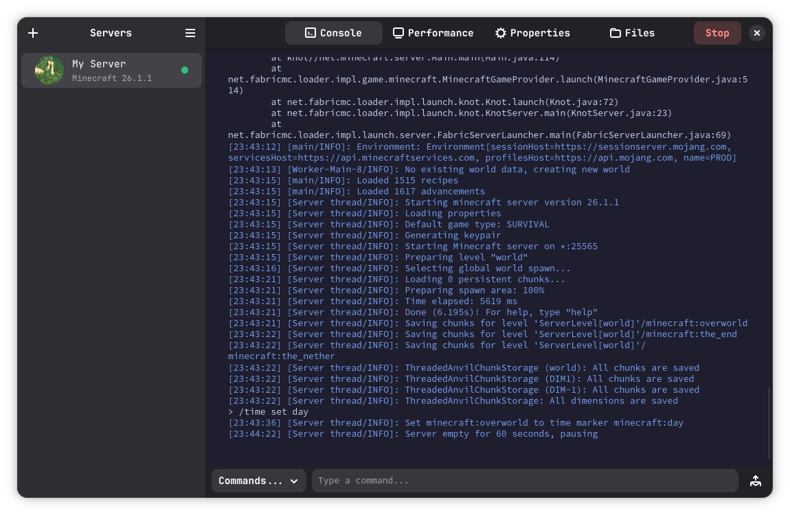
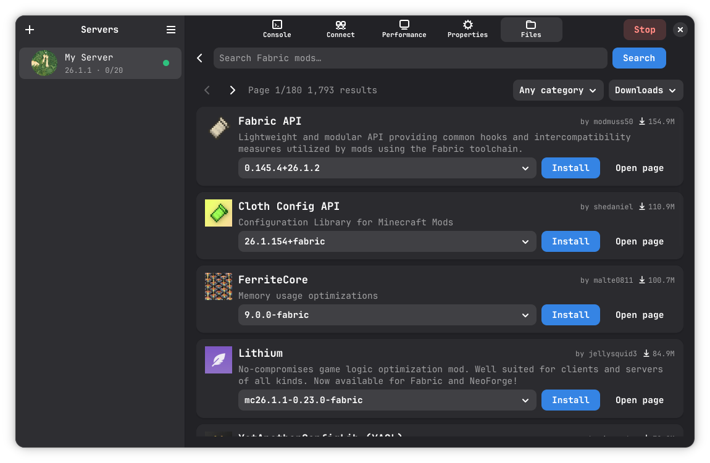
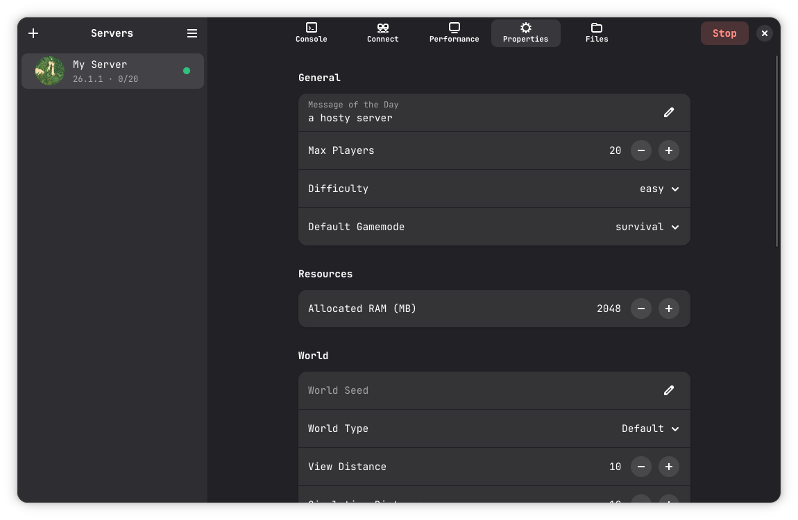

# Hosty

Hosty is a desktop app for making and managing Minecraft Fabric servers.

It helps you set up a server, run it, and manage it without juggling lots of separate tools. The goal is to keep server management simple and friendly. 🙂

## What Hosty does

- Creates Fabric servers with a guided flow
- Starts and stops your servers
- Shows server console output
- Helps manage server settings and files

## Run the app

### Linux release (Flatpak)

1. Download the latest `Hosty-<version>-x86_64.flatpak` from GitHub Releases.
2. Install it:
	flatpak install --user --from ./Hosty-<version>-x86_64.flatpak
3. Run it:
	flatpak run com.github.hosty.Hosty

The Flatpak release bundles Python and app dependencies, so no manual Python or pip setup is required.

### Windows

1. Install dependencies:
	python -m pip install -r requirements-windows.txt
2. Run Hosty:
	python hosty.py

### Linux

Source/development run:

1. Install GTK4/libadwaita and PyGObject system packages.
2. Install Python dependencies:
	python3 -m pip install requests psutil pystray Pillow
3. In this folder, run:
	python3 hosty.py

## Project layout

- hosty.py starts the app
- hosty/ contains the app code (UI, backend, dialogs, and utilities)

## Versioning

- App version source: `APP_VERSION` in `hosty/utils/constants.py`
- Release artifacts are versioned automatically from `APP_VERSION`
- Recommended release flow:
	1. Bump `APP_VERSION`
	2. Create and publish a GitHub release tag (for example `v1.0.1`)

Hosty is built for people who want a clean way to host Fabric servers locally. 🚀

## Showcase

Screenshots — Hosty in action:

  

- **Console:** View server output, chat, and run server commands.

  

- **Mods:** Manage installed mods and downloads.

  

- **Properties:** Edit `server.properties` and configuration options.