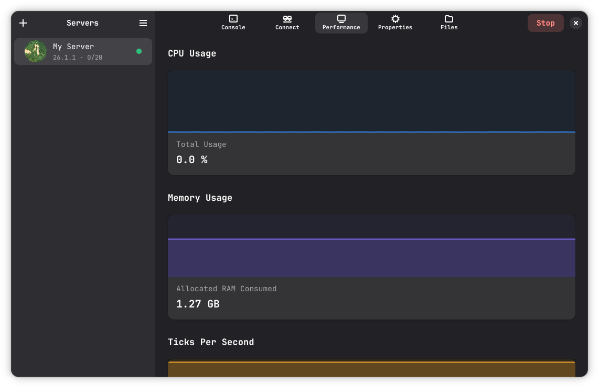
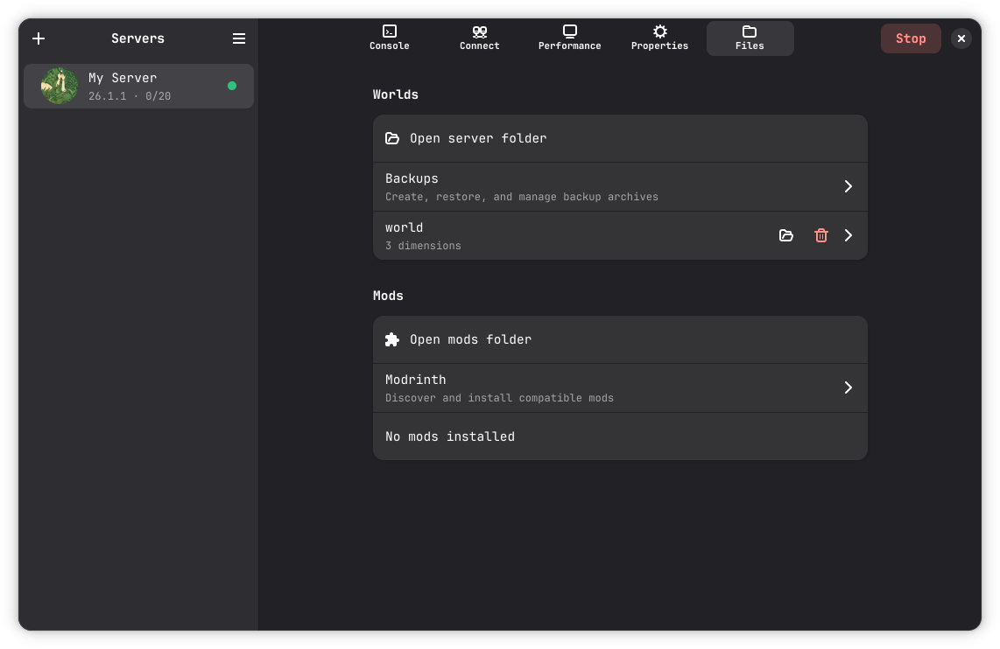
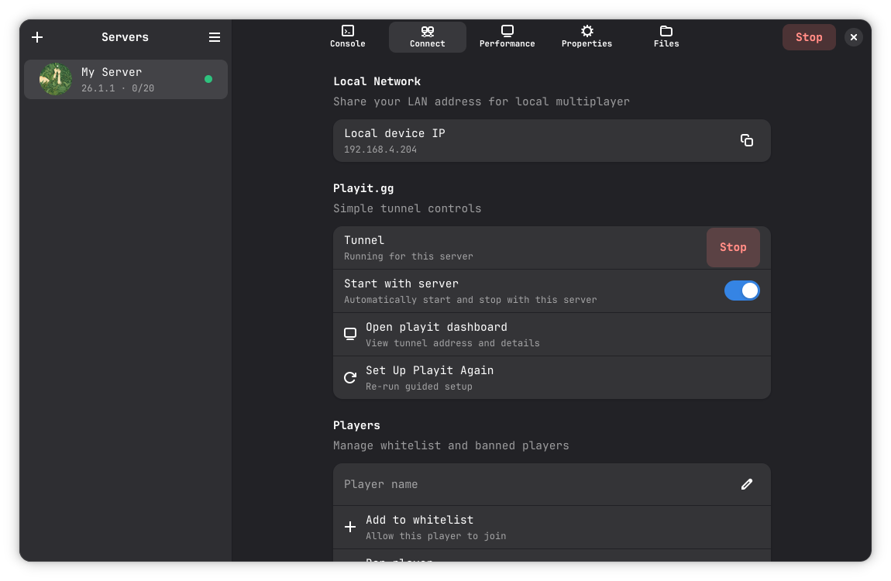
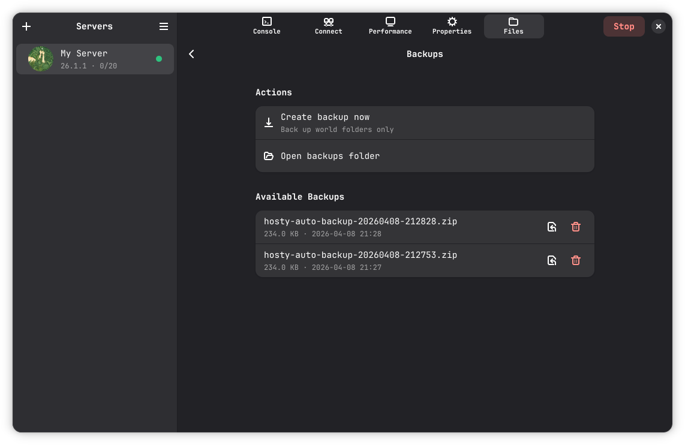

# Hosty

Hosty is a desktop app for creating, running, and managing Minecraft Fabric servers with a clean, native-style UI.

It keeps the full server workflow in one app: setup, start/stop, monitoring, mod management, backups, and player access controls.

## Why Hosty?


- Easy to use: set up and run a Fabric server without juggling scripts, terminals, or scattered tools.
- Auto-downloads dependencies: Hosty fetches what your server needs, including Java when it is missing.
- All in the app: setup, start/stop, live monitoring, mod management, backups, and access controls in one place.
- Built for real hosting: stream logs, send commands, tweak settings, and manage worlds without leaving Hosty.
- Less manual maintenance: practical backup and restore tools help you recover quickly when something goes wrong.


## Run Hosty

- Linux: use the Flatpak release from GitHub Releases.
- Windows: use the EXE release from GitHub Releases. (Note: The Windows version is currently a work in progress.)

<details>
<summary>Run from source (Python)</summary>

### Linux

1. Install GTK4/libadwaita and PyGObject system packages.
2. Install Python dependencies:

```bash
python3 -m pip install requests psutil pystray Pillow
```

3. Run Hosty:

```bash
python3 hosty.py
```

### Windows

1. Install Python dependencies:

```bash
python -m pip install -r requirements-windows.txt
```

2. Run Hosty:

```bash
python hosty.py
```

</details>

## Screenshots

<p align="center">
	
</p>

- Console: stream logs and send commands.

<p align="center">
	
</p>

- Performance: monitor live server performance.

<p align="center">
	
</p>

- Properties: edit server settings with autosave.

<p align="center">
	
</p>

- Files: manage worlds, dimensions, and backups.

<p align="center">
	
</p>

- Mods: browse Modrinth, install mods, and auto-manage dependencies.

<p align="center">
	
</p>

- Connect: configure Playit and manage whitelist/ban lists.

<p align="center">
	
</p>

- Backups: create and restore world backups.